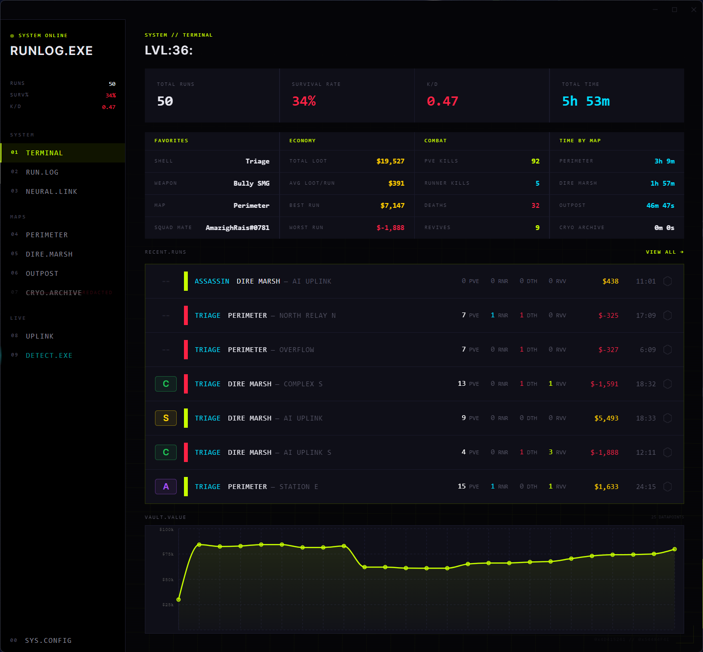
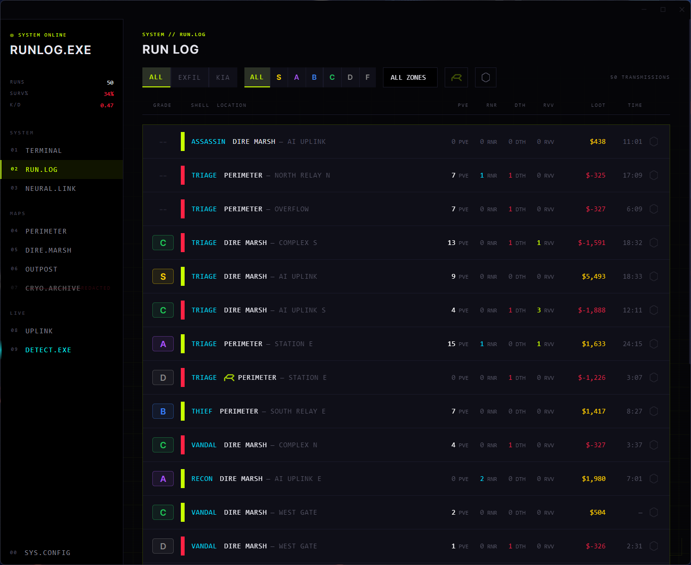
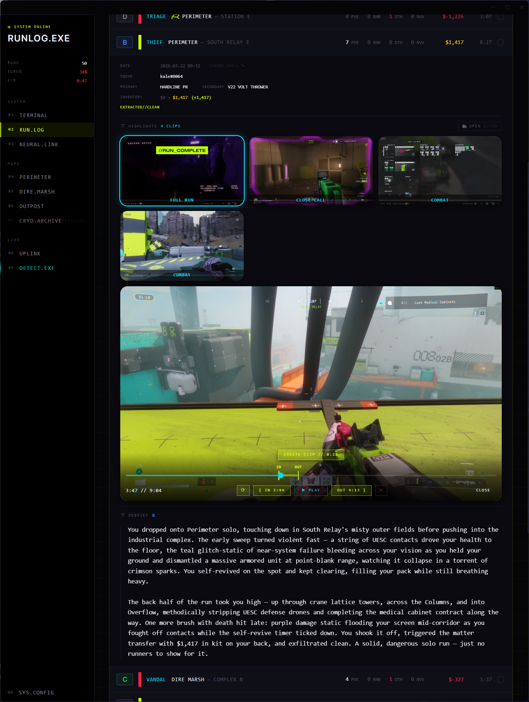
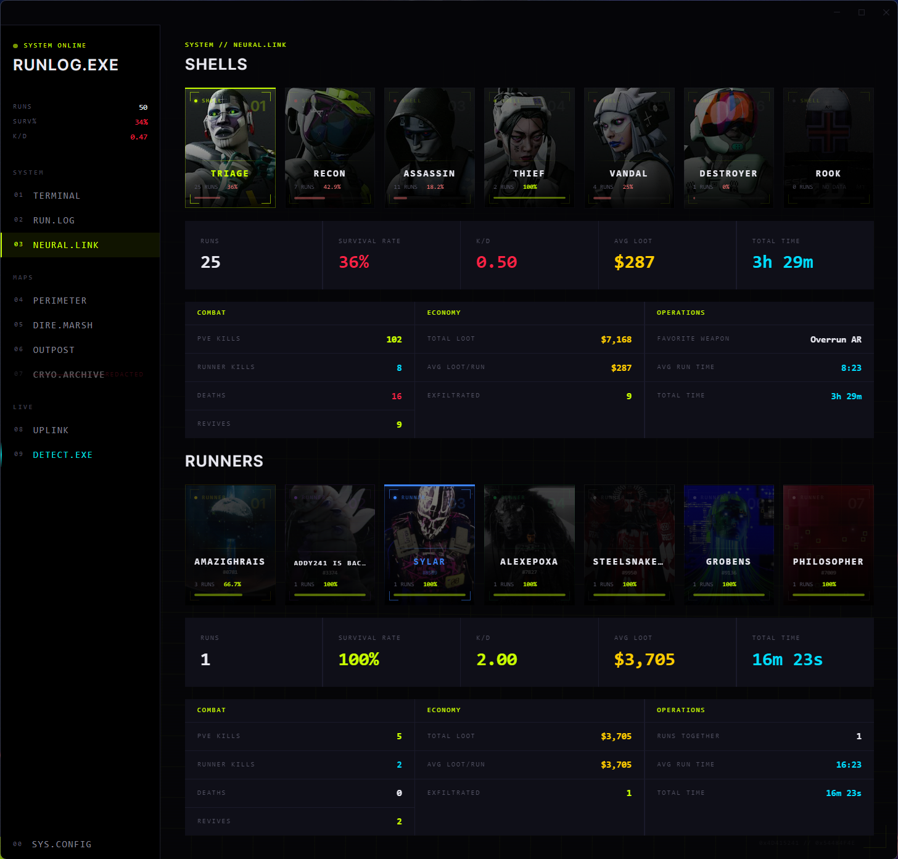
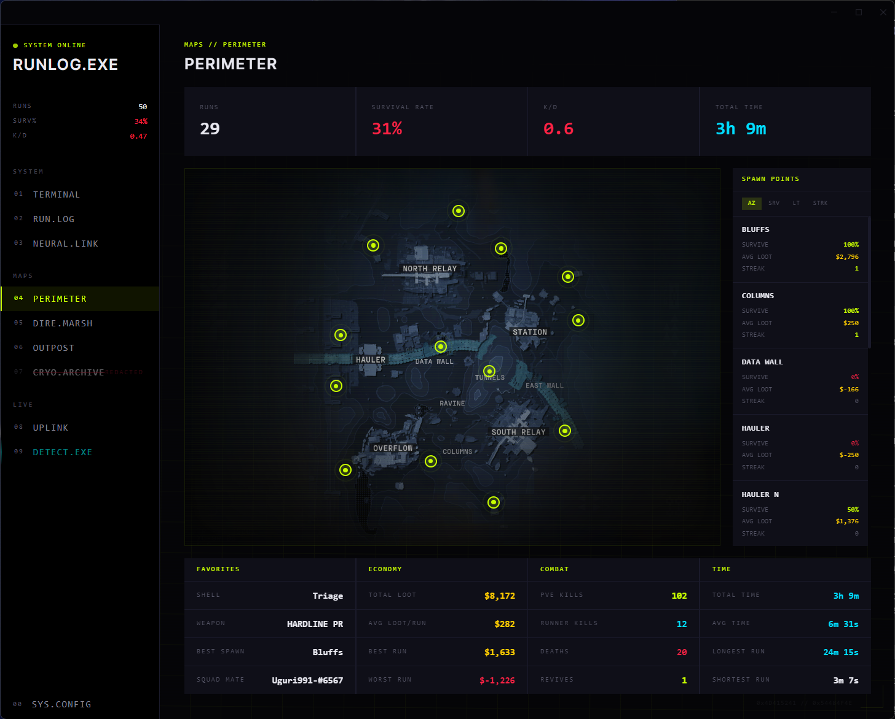
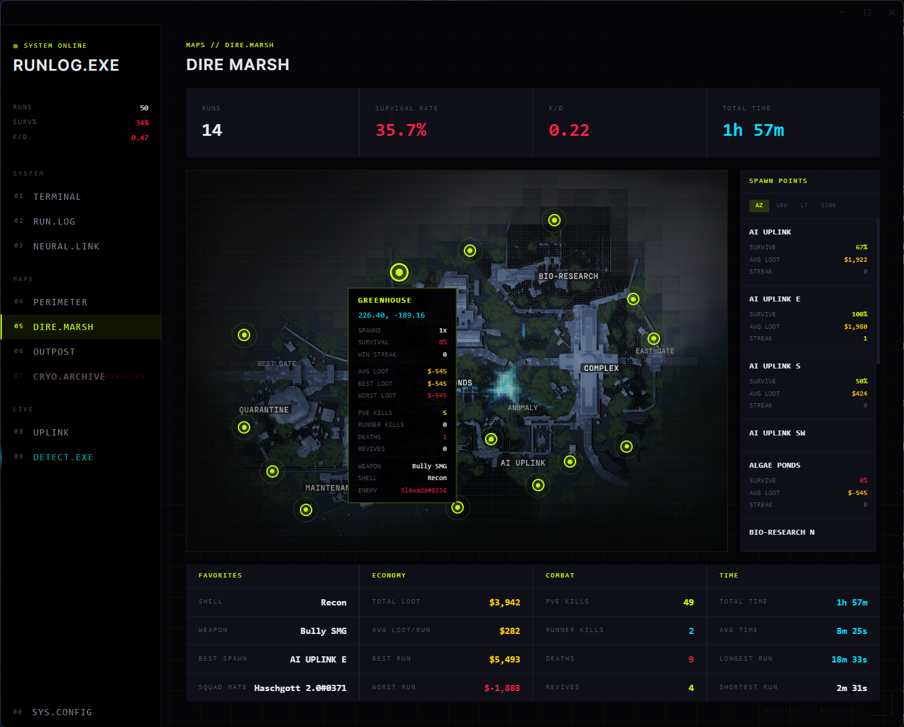
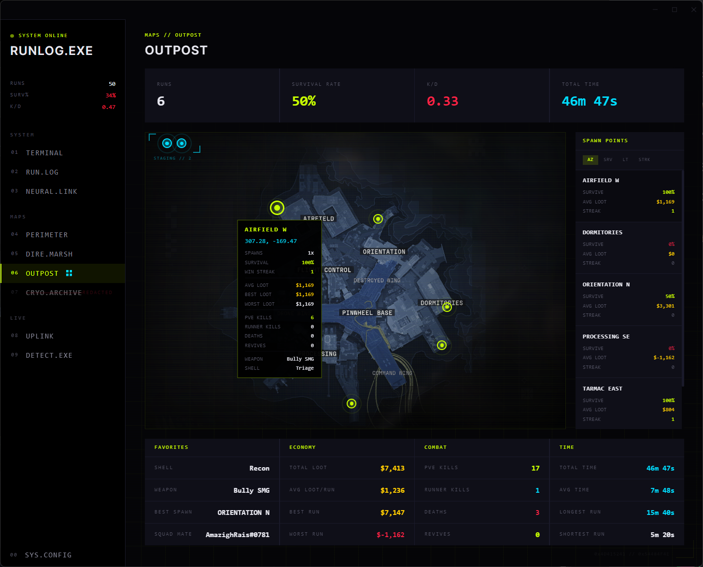
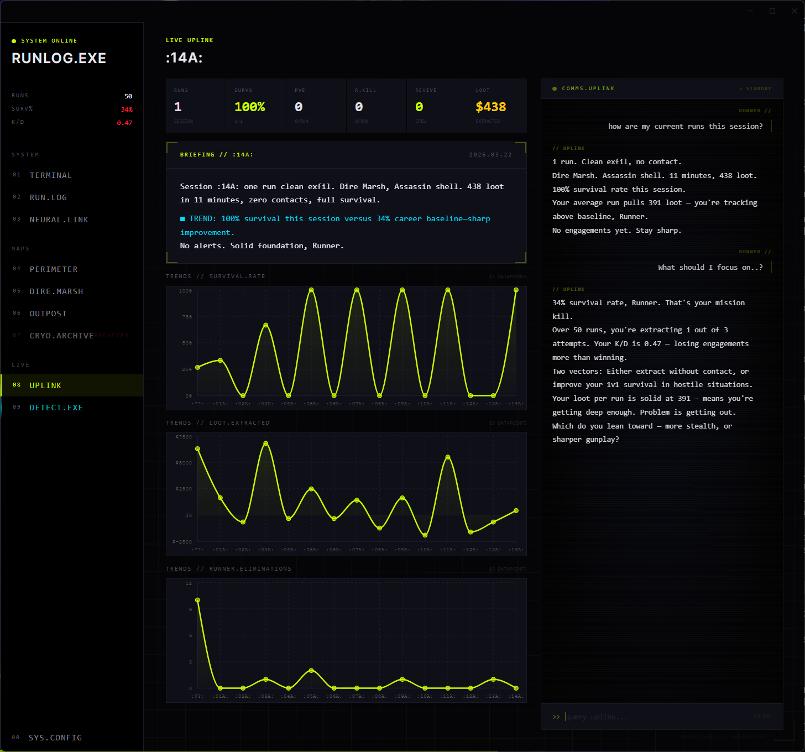
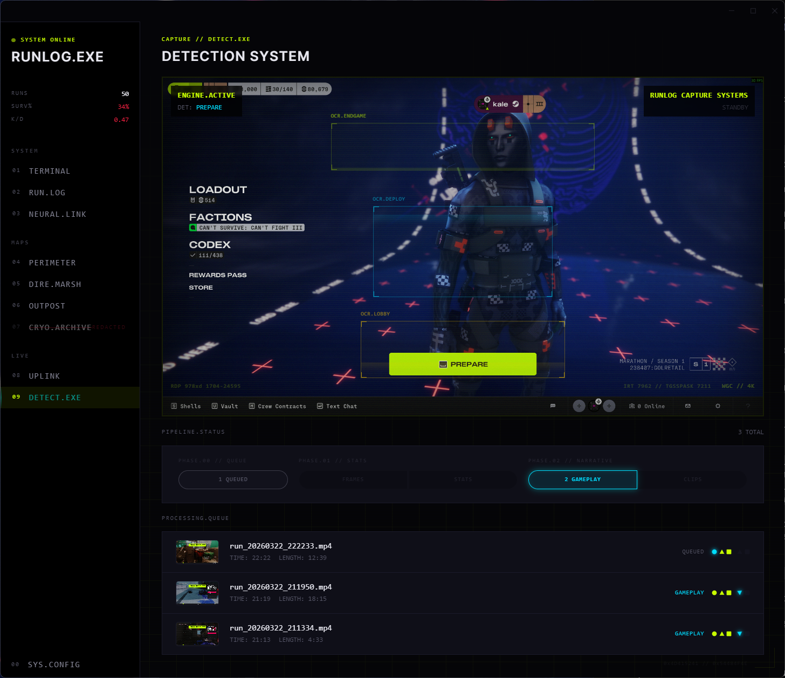

# runlog.exe

A local-first desktop companion for **Marathon** (Bungie, 2026). Play your runs, stats appear automatically.

Records your gameplay with a zero-copy GPU capture engine, then uses AI to extract stats, identify your shell, grade your performance, write narrative run reports, generate highlight clips, and power a tactical advisor. No manual data entry, no accounts, no cloud.

---

## How It Works

```
1. Launch runlog.exe — sits in your system tray
2. Launch Marathon — detected automatically via Windows Graphics Capture
3. Play normally — recording starts when you deploy, stops when you return to lobby
4. Stats extracted automatically (kills, deaths, loot, map, spawn, shell, loadout)
5. Narrative report + highlight clips generated asynchronously
6. Dashboard, maps, and run history update automatically
```

---

## TERMINAL

Your command center. Career stats at a glance — total runs, survival rate, K/D, total play time. Favorites show your most-used shell, weapon, map, and squad mate. Economy tracks total loot, average per run, best and worst. Recent runs feed in the center, vault value chart tracking your wealth over time.



---

## RUN.LOG

Complete history of every run. Each row shows shell, map, spawn, PvE and PvP kills, deaths, revives, loot gained or lost, duration, and letter grade (S through F). Filters stack — narrow by outcome, grade, map, ranked mode, and favorites.



Expand any run for the full breakdown — squad, weapons, inventory value change, killed-by with full damage contributors, and auto-generated highlight clips with sprite sheet hover scrub. Built-in video player with custom clip editor — set IN/OUT markers, name your clip, instant stream copy from the original 4K footage. AI debrief narrative at the bottom grades and recaps the run.



---

## NEURAL.LINK

Two sections, **Shells** and **Runners**, both ranked by weighted performance score.

**Shells** — all 7 Marathon character classes. Per-shell stats: runs, survival rate, K/D, avg loot, combat breakdown, economy.

**Runners** — your top 7 squad mates. Per-mate stats show how your survival rate and loot change when you play together.



---

## MAPS

Each map has its own page with interactive spawn markers, per-map stats (runs, survival rate, K/D, total time), a scrollable spawn point list, and map-wide breakdowns for favorites, economy, combat, and time. Spawn coordinates are extracted from the deployment loading screen and matched to map locations — every run's stats automatically accumulate at the spawn point you deployed from.



Hover any spawn marker for per-spawn stats — survival rate, win streak, loot averages, kill counts, favorite weapon and shell. Also shows your top enemy from runs at that spawn.



New spawns are detected automatically and staged in the top-left bracket as uncharted markers. Drag them onto the map, rename them, and save. Future runs with matching coordinates will automatically log to that spawn.



---

## UPLINK

AI tactical advisor and session tracker. Every time you launch the app and play, a new session is created. UPLINK generates a briefing for each session — how many runs, survival rate, trends vs your career baseline, and alerts when you're performing above or below average. Charts track survival rate, loot, and runner eliminations across sessions. Terminal-style chat interface — ask UPLINK anything about your stats and it queries your database directly.



---

## DETECT.EXE

Where the magic happens. The detection engine watches your game, auto-records every run from deployment to lobby, and feeds recordings into the processing pipeline — stats, narrative, and highlight clips, all hands-free. Just play.



---

## Under the Hood

### Capture Engine
- **Rust binary** (`runlog-recorder.exe`) — Windows Graphics Capture API, zero-copy GPU pipeline
- **MediaFoundation encoding** — 60fps at native 4K, HEVC or H.264 (configurable)
- **Privacy-safe** — captures only the Marathon window, never the desktop
- **OCR state machine** — three scan regions detect deployment (start), RUN_COMPLETE (timestamp), and lobby (stop)
- **Per-phase screenshots** — READY UP, RUN, DEPLOYING phases captured for shell/loadout identification

### Two-Phase AI Analysis
- **Phase 1 (Stats):** Three parallel Claude calls extract map, shell (facial geometry matching), spawn coordinates, plus a sequential call for kills, deaths, loot, weapons, damage contributors from end-of-run screenshots
- **Phase 2 (Narrative):** Chain-of-thought video analysis — scene inventory, event identification, then grade + summary + highlight timestamps. Clips cut via stream copy from original 4K footage

### Highlight Clips
- Auto-generated from Phase 2 — every PvP kill, death, revive, and extraction clipped
- Chain-of-thought prompting reduces hallucinated clips
- Custom clip editor with IN/OUT markers on any video
- Stream copy from original footage — no re-encoding, instant cuts
- Sprite sheets for hover scrub preview on every clip

---

## Tech Stack

| Layer | Tech |
|---|---|
| Desktop | Electron |
| Frontend | React + TypeScript + Vite |
| Styling | Tailwind CSS |
| State | Zustand |
| Charts | Recharts |
| Backend | Python FastAPI |
| Database | SQLite (local-first, auto-backup) |
| AI | Claude API (Sonnet/Haiku) or Claude CLI |
| Capture | Rust (WGC + MediaFoundation HEVC/H.264) |
| OCR | EasyOCR |
| Video | FFmpeg |

---

## Getting Started

### One-Click Install

```
1. Clone this repo
2. Double-click install.bat
3. Wait for it to finish (~5-10 minutes on first install)
4. Double-click the runlog.exe shortcut to launch
```

The install script automatically checks for and installs all prerequisites (Python 3.12+, Node.js, FFmpeg, Rust), downloads all dependencies, builds the Rust recorder, and packages the app. No manual setup required.

### Authentication

Once the app is running, go to **SYS.CONFIG** and set up Claude AI access. Two options — set your preferred provider with the **AI.PROVIDER** toggle:

1. **API Key** — Paste your Anthropic API key, tested before saving
2. **Claude CLI** — Install Claude Code (`npm install -g @anthropic-ai/claude-code`), log in via the in-app LOGIN button or `claude login` in terminal. Uses your Claude subscription, no API tokens needed. Version detection and one-click updates built in.

If only one method is configured, it auto-selects. If the preferred method fails, the other is used as fallback.

For a complete walkthrough of every feature, see the [User Guide](docs/user-guide.md).

### Development (Manual Setup)

If you prefer to set things up manually or want to run in dev mode:

```bash
# Backend
cd backend
pip install -r requirements.txt

# Build Rust recorder
cd backend/recorder
cargo build --release

# Frontend
cd frontend
npm install
```

```bash
# Terminal 1 — Backend
cd backend && RUNLOG_DEV=1 python run.py

# Terminal 2 — Frontend
cd frontend && npm run electron:dev
```

### Build

```bash
cd frontend && npm run dist
# Output in release/win-unpacked/
```

---

## Local-First

- All data stored locally: `%APPDATA%/runlog/marathon/data/`
- No accounts, no cloud sync, no telemetry
- Automatic database backups on startup (keeps last 7)
- Works offline for everything except AI analysis
- Your API key stays on your machine
